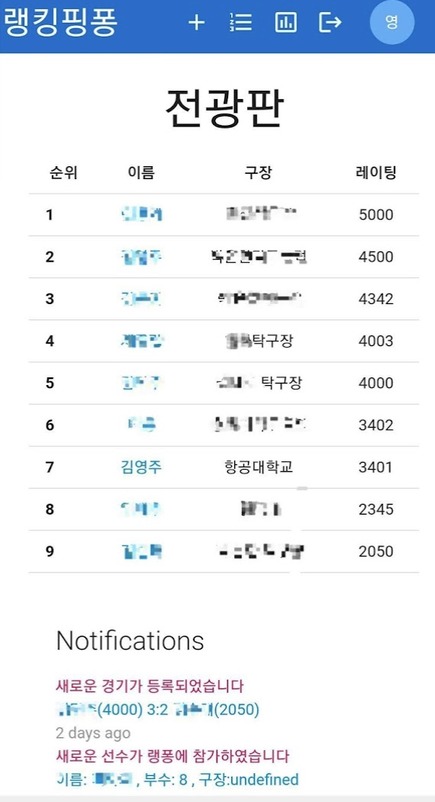
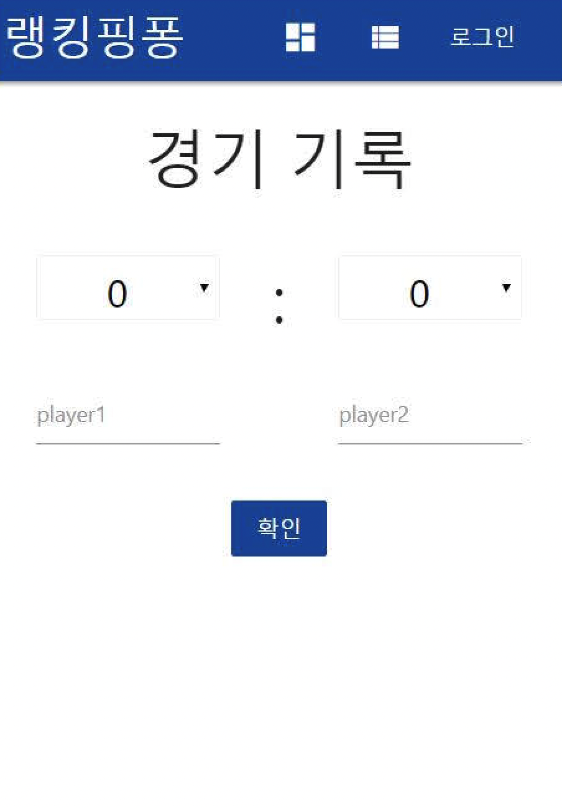
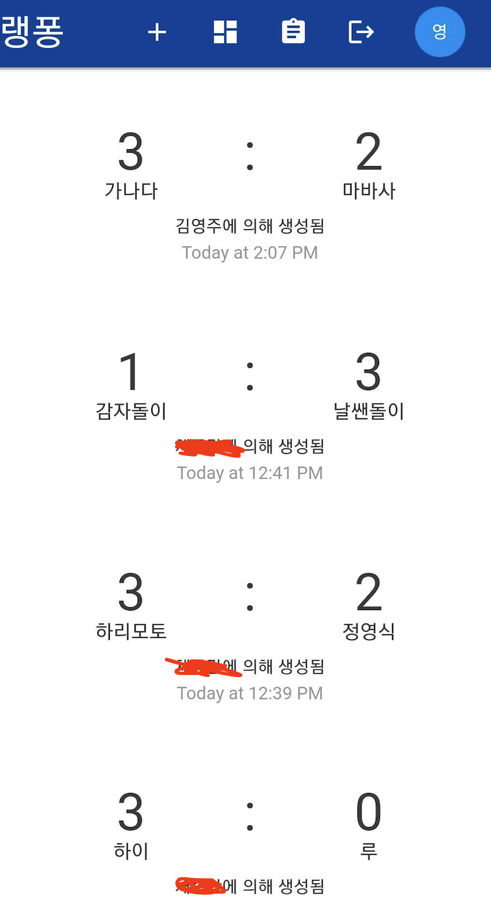
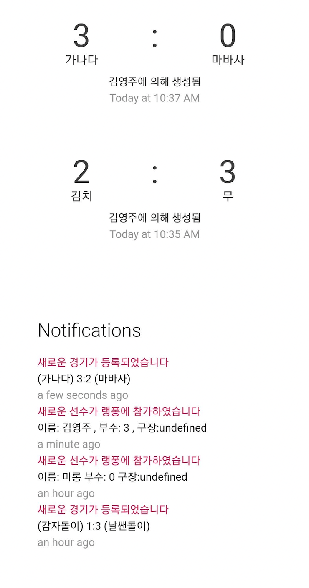

# 랭킹핑퐁

랭킹퐁은 탁구인들의 전적을 등록, 검색 기능을 제공하고 레이팅을 산출하여 재밌게 운동을 할 수 있도록 만들어진 웹/앱 어플리케이션입니다

## 사용 기술 스택
- React(프론트엔드)
- BootStrap(프론트엔드)
- node.js(백엔드)
- FireBase NoSQL 데이터베이스


# 대시보드(전광판)

현재 랭킹핑퐁에 등록된 주요 선수들 리스트를 표시하는 화면



# 경기 등록

경기를 등록하고 싶을 때 경기 사용자와 함께 스코어를 입력하여 등록합니다. (레이팅은 자동으로 갱신됩니다.)
 



# 개인 경기기록

개인 전적을 확인하고 싶을 때 볼 수 있는 화면입니다.



# Notifications

경기가 등록되거나, 새로운 유저가 가입되었을 때 발생하는 notification.




## 참고사항

### 프론트앤드 서버 실행방법

깃헙 클론 후 아래 명령어 입력후 http://localhost:3000  접속.
```
  npm start
```


 웹 기반 어플리케이션에, BootStrap으로 CSS를 구성하였기 때문에 모바일과, 데스크탑 환경에서 모두 사용 가능합니다. 어플리케이션 특성상 모바일로 접속하는 유저가 많을 것이라 생각하여 모바일 위주로 만들었습니다.